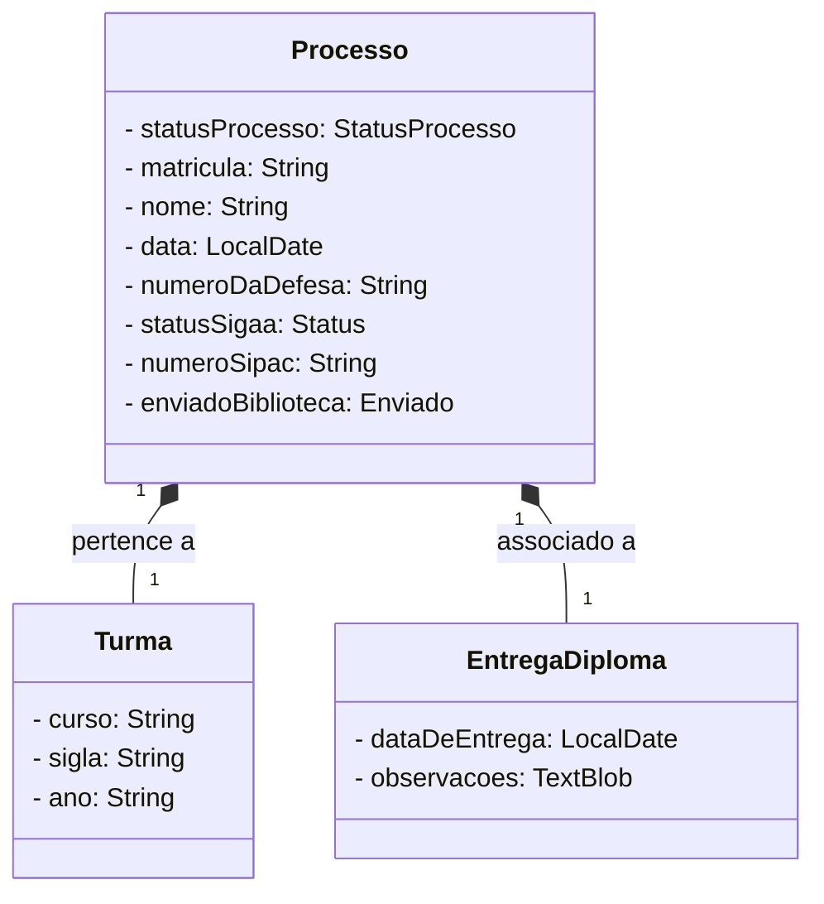

# Sistema de Controle de Emissão de Diploma - SICED
Aplicação desenvolvida através de um gerador de aplicações chamado JHIPSTER, para atender a necessidade de gerenciamento das emissões de diplmas
da Universidade federal do Pará - UFPA.

#Representação do Diagrama de classes da aplicação.

[jhipster homepage and latest documentation]: https://www.jhipster.tech
[jhipster 7.9.4 archive]: https://www.jhipster.tech/documentation-archive/v7.9.4
[using jhipster in development]: https://www.jhipster.tech/documentation-archive/v7.9.4/development/
[using docker and docker-compose]: https://www.jhipster.tech/documentation-archive/v7.9.4/docker-compose
[using jhipster in production]: https://www.jhipster.tech/documentation-archive/v7.9.4/production/
[running tests page]: https://www.jhipster.tech/documentation-archive/v7.9.4/running-tests/
[code quality page]: https://www.jhipster.tech/documentation-archive/v7.9.4/code-quality/
[setting up continuous integration]: https://www.jhipster.tech/documentation-archive/v7.9.4/setting-up-ci/
[node.js]: https://nodejs.org/
[npm]: https://www.npmjs.com/
[webpack]: https://webpack.github.io/
[browsersync]: https://www.browsersync.io/
[jest]: https://facebook.github.io/jest/
[leaflet]: https://leafletjs.com/
[definitelytyped]: https://definitelytyped.org/
[angular cli]: https://cli.angular.io/
[openapi-generator]: https://openapi-generator.tech
[swagger-editor]: https://editor.swagger.io
[doing api-first development]: https://www.jhipster.tech/documentation-archive/v7.9.4/doing-api-first-development/
